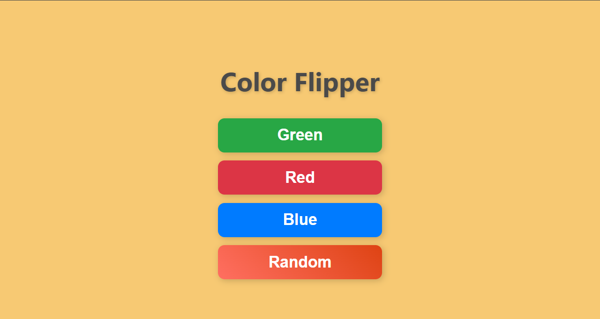

# Color Flipper

Color Flipper is a simple web application that allows users to change the background color of the page by selecting from predefined colors (Green, Red, Blue) or generating a random color.

## Features

- **Predefined Colors**: Choose between Green, Red, or Blue to change the background color.
- **Random Color**: Generate a random background color with a single click.

## Screenshot

