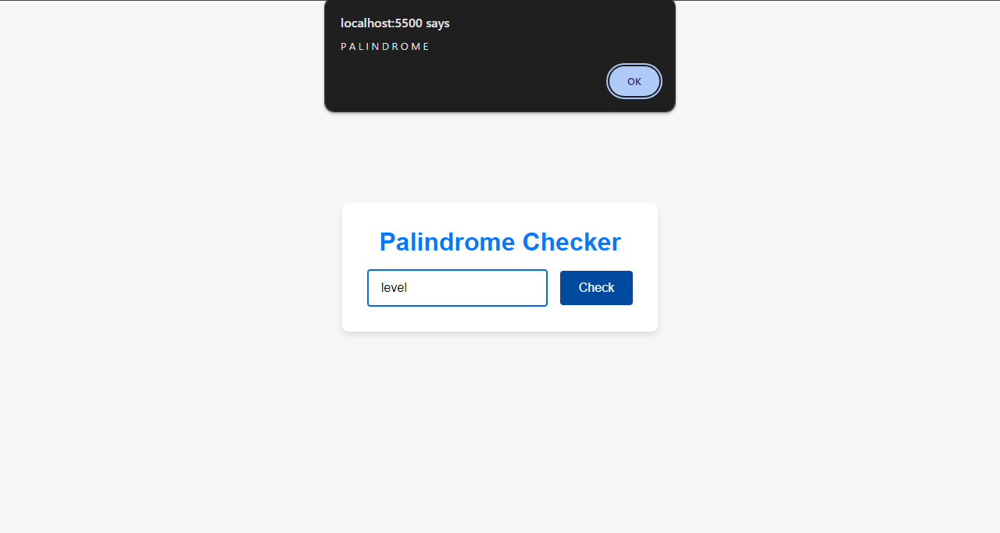

# Palindrome Checker

A simple web application that checks whether a given word or phrase is a palindrome.

## Features

- Minimalistic UI for checking palindromes.
- Provides instant feedback on whether the input is a palindrome.
- Responsive design suitable for all devices.

## Usage

1. Open the application.
2. Enter a word or phrase in the input box.
3. Click the "Check" button.
4. The application will display whether the input is a palindrome or not.

## Screenshots

