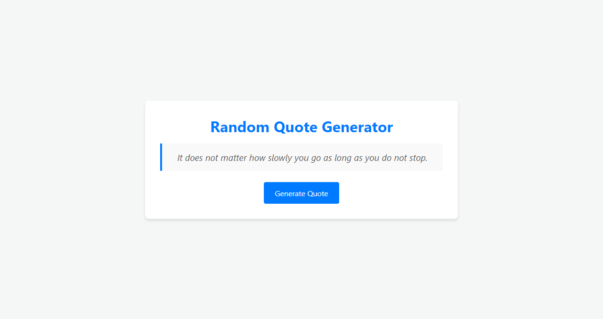

# Random Quote Generator

A simple web application that generates a random quote with a click of a button.

## Features

- Generates a random quote each time the button is clicked.
- Clean and modern UI design.
- Responsive layout that adapts to all screen sizes.

## Usage

1. Open the application.
2. Click the "Generate Quote" button.
3. A new quote will appear in the quote box.

## Screenshots

