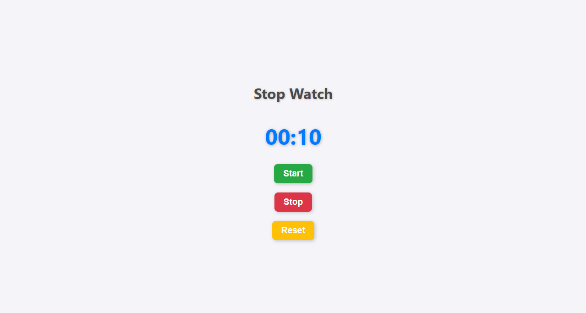

# Stopwatch

A simple stopwatch application that allows you to start, stop, and reset the timer. This project demonstrates basic JavaScript functionality along with modern UI design using HTML and CSS.

## Features

- **Start Timer**: Begins the stopwatch.
- **Stop Timer**: Pauses the stopwatch at the current time.
- **Reset Timer**: Resets the stopwatch to `00:00`.

## Usage

1. Open the `index.html` file in your web browser.
2. Click the "Start" button to begin the stopwatch.
3. Click the "Stop" button to pause the stopwatch.
4. Click the "Reset" button to reset the stopwatch to `00:00`.

## Screenshots

