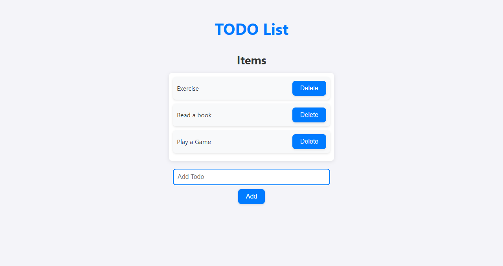

# To-Do List

A simple To-Do List application that allows you to add, view, and delete tasks. The application uses local storage to save your tasks so they persist even after the page is refreshed.

## Features

- **Add Task**: Input a task and add it to the list.
- **View Tasks**: Displays all tasks currently in the list.
- **Delete Task**: Remove a task from the list.

## Usage

1. Open the `index.html` file in your web browser.
2. Type a task in the input field and click "Add" to add it to your list.
3. View your tasks in the list displayed below the input field.
4. Click the "Delete" button next to a task to remove it from the list.

## Screenshots

