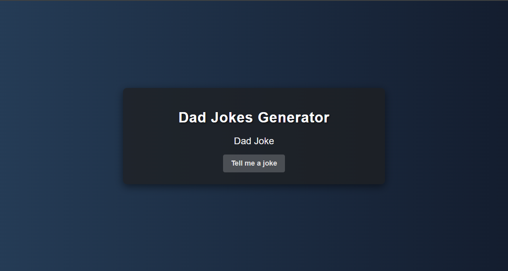
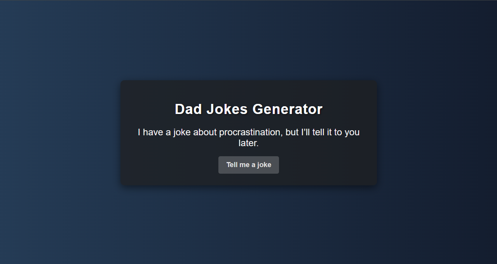

# Dad Jokes Generator

A fun web application that generates dad jokes at the click of a button. This project demonstrates how to fetch data from an API and update the UI dynamically using JavaScript.

## Features

- **Fetch Dad Jokes**: Click the button to get a new dad joke.
- **Error Handling**: Displays an error message if something goes wrong while fetching the joke.

## Usage

1. Open the `index.html` file in your web browser.
2. Click the "Tell me a joke" button to fetch a new dad joke.
3. The joke will be displayed on the page.

## Note

To use the Dad Jokes Generator, you need to replace `"your_api_key"` in `index.js` with your actual API key from the API Ninjas.

## Screenshots

