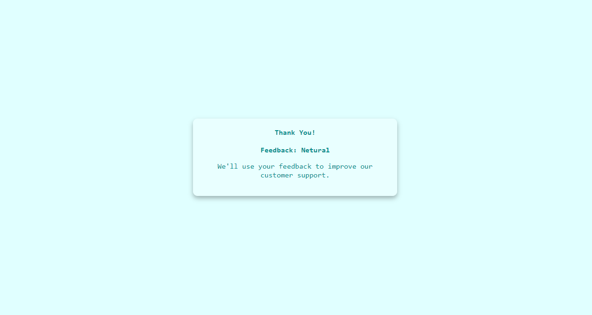

# Feedback UI

## Overview

The Feedback UI project is a simple web application designed to collect user feedback through a visual rating system. Users can select a rating by clicking on one of the rating options, and then submit their feedback using a button. The interface is styled to be visually appealing and user-friendly.

## Features

- **Rating System**: Users can choose from three rating options: Unhappy, Neutral, and Satisfied.
- **Interactive UI**: Clicking on a rating option highlights it and displays the user's selected rating.
- **Feedback Submission**: Once a rating is selected, users can click the "Send Review" button to submit their feedback, which then displays a thank-you message along with the selected rating.

## Screenshots

