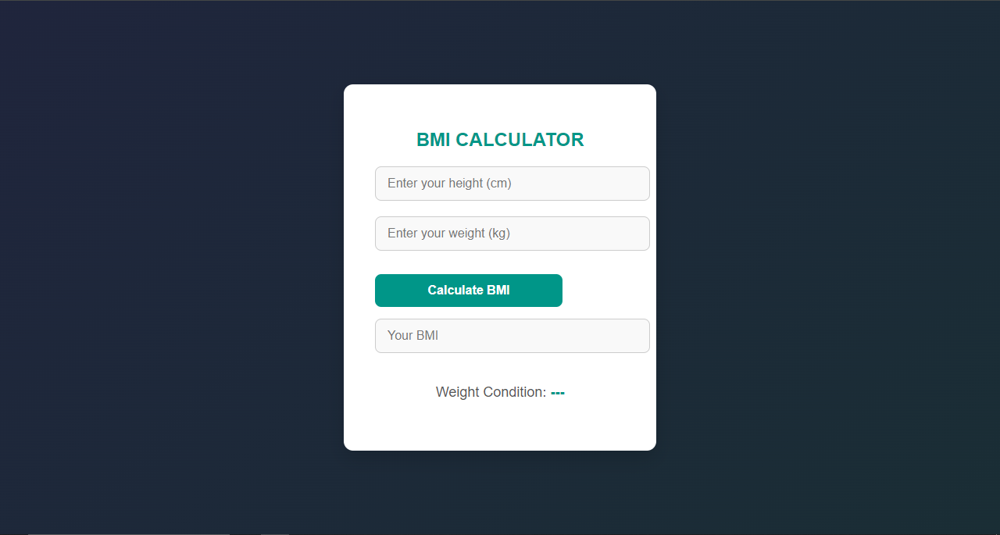
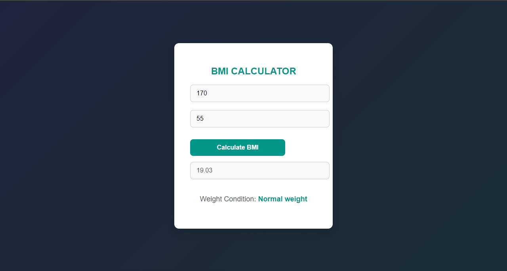

# BMI Calculator

This is a simple **Body Mass Index (BMI) Calculator** built with HTML, CSS, and JavaScript. It allows users to input their height and weight, and calculates their BMI, along with displaying the corresponding weight condition.

## Features

- Input fields for height (in cm) and weight (in kg)
- Calculate BMI based on the user's height and weight
- Displays the calculated BMI value
- Provides a message about the user's weight condition (Underweight, Normal weight, Overweight, Obesity)
  
## Screenshots

