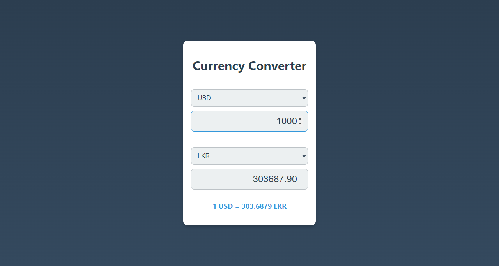

# Currency Converter

A simple web-based currency converter that fetches exchange rates and converts amounts between two selected currencies. The exchange rate data is fetched using the [ExchangeRate-API](https://www.exchangerate-api.com/).

## Features

- Select two currencies and input the amount in the first currency to get the converted value in the second currency.
- Live exchange rate fetched from ExchangeRate-API.
- Automatically updates the converted value when the input amount or currency selection changes.

## Note

**API Key**: You'll need an API key from [ExchangeRate-API](https://www.exchangerate-api.com/).

## Screenshots

