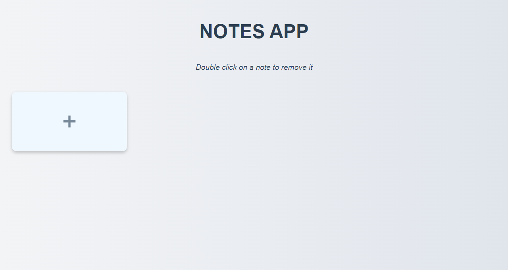

# Notes App

A simple **Notes App** built using HTML, CSS, and JavaScript. This app allows users to create, update, and delete notes, with all notes stored in the browser's local storage.

## Features

- Create new notes by clicking the `+` button.
- Automatically save notes to local storage.
- Update existing notes by typing directly in the note field.
- Delete a note by double-clicking on it and confirming the deletion.
- Persist notes between page reloads using local storage.

## Screenshots

