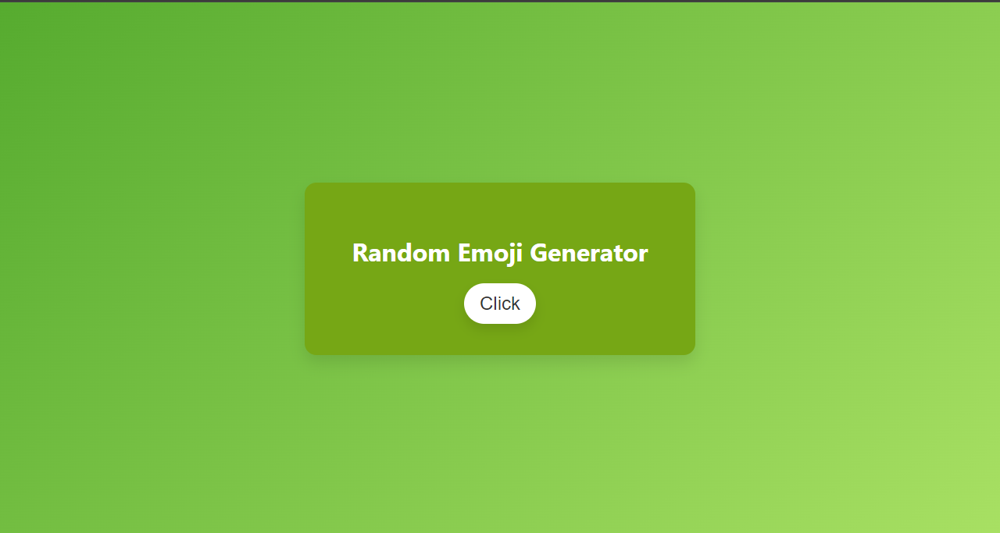
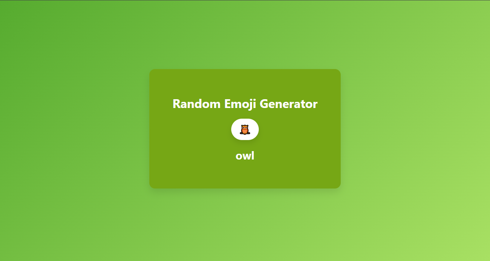

# Random Emoji Generator

This project is a **Random Emoji Generator** that fetches random emojis and displays their names using the Emoji API. It allows users to dynamically generate a new emoji along with its name by clicking a button. The project demonstrates the use of HTML, CSS, and JavaScript to interact with an external API and update the UI accordingly.

## Features

- Fetches random emojis using the [Emoji API](https://emoji-api.com/).
- Simple and modern UI design with a clean, responsive layout.
- Includes smooth button animations and hover effects.
- Handles dynamic content loading using JavaScript.

## How It Works

1. On page load, the application is ready for interaction.
2. When the user clicks the "Get Random Emoji" button, a random emoji is fetched from the Emoji API.
3. The emoji and its name are displayed in the UI.
4. The app removes the emoji version numbers (e.g., "E1.0") from the emoji names for better readability.

## API Reference

- **[Emoji API](https://emoji-api.com/)**: Used to fetch random emojis and their metadata. You will need to obtain an API key to use this.

## Screenshots

### Initial View

### After Generating a Random Emoji

