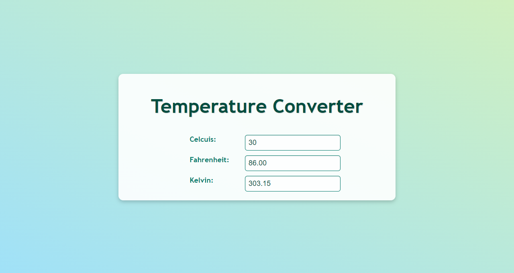

# Temperature Converter

A simple web application that converts temperature between Celsius, Fahrenheit, and Kelvin.

## Features

- Convert temperature between Celsius, Fahrenheit, and Kelvin.
- Real-time input conversion as you type.
- Responsive and user-friendly interface.

## Formulas Used

- **Celsius to Fahrenheit**: 
    ``` 
    °F = (°C × 1.8) + 32
    ```
- **Celsius to Kelvin**: 
    ``` 
    K = °C + 273.15
    ```
- **Fahrenheit to Celsius**: 
    ``` 
    °C = (°F - 32) / 1.8
    ```
- **Fahrenheit to Kelvin**: 
    ``` 
    K = (°F - 32) / 1.8 + 273.15
    ```
- **Kelvin to Celsius**: 
    ``` 
    °C = K - 273.15
    ```
- **Kelvin to Fahrenheit**: 
    ``` 
    °F = (K - 273.15) × 1.8 + 32
    ```

## Screenshots




